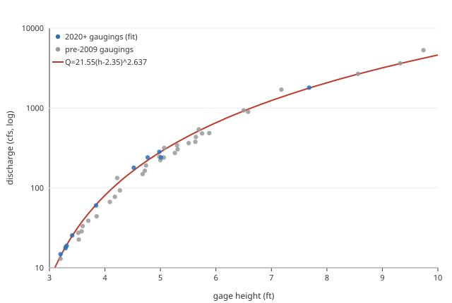

# Stage→discharge rating: Little North Santiam at Elkhorn (USGS 14181900 / NWRFC LNEO3)

**Status:** **deployed** — `calc_expression` id 26
(`provenance_slug = littlensantiam_14181900_stage_rating`) on gauge 235 reads this
rating, so this report is referenced (not an orphan).

**Goal:** The Little North Santiam gauge at Elkhorn reports **gage height only** —
USGS `14181900` and NWRFC/NWS `LNEO3` are the *same* site (NWPS confirms
`LNEO3 → usgsId 14181900`), and **neither publishes discharge**. This is **not** a
"flow was rated then dropped" case: USGS has never run Elkhorn as a continuous-discharge
station (its published `00060` daily series is **2 values, winter 1972-73**), and NWRFC
carries only the `HG` (stage) product. Reconstruct a stage→discharge rating from the
gauge's own field gaugings so a `calc_expression` can turn the live stage into CFS for
reach `4o` (Salmon Falls to Elkhorn, id 272).



This is a **same-gauge rating curve** fit to USGS field gaugings (direct discharge
measurements), not the `gauge_pair_linear.py` regression (estimate one gauge from
others). The `.svg`/`.json` sidecars are hand-generated.

## The rating

> **Q = 21.55 · (h − 2.35)^2.637**   (h = gage height ft, Q = cfs)

- log-log **r² = 0.999**, relative RMSE **7.1%** vs the fitted gaugings.
- Fit on the **10 current-gage (2020+) field gaugings**, the period that matches the
  channel the live feed reads (see *Continuous drift* for why not all 44).
- Well-constrained **3.2–7.7 ft (~15–1800 cfs)** by the modern gaugings, and the same
  curve independently reproduces the older high-flow gaugings to 9+ ft (see
  *Validation*) — it covers everything runnable. The lone 1975 extreme (9.74 ft /
  5300 cfs) sits ~20% above the curve; that is far above any boatable level.

| stage (ft) | 3.5 | 4.0 | 4.5 | 5.0 | 6.0 | 7.0 | 8.0 |
|---|---|---|---|---|---|---|---|
| Q (cfs) | 31 | 81 | 162 | 282 | 655 | 1240 | 2073 |

Current (2026-06): **~4.2 ft → ~109 cfs**.

## Data

All USGS site `14181900`, plus NWRFC `LNEO3`.

| Series | Extent | Notes |
|---|---|---|
| Gage height `00065` (continuous) | **2020-11 → present** | the live feed we serve (USGS + NWRFC LNEO3) |
| Discharge `00060` (published daily) | 1972-11 → 1973-03, **2 values** | never a continuous-discharge station |
| Field gaugings `00060`+`00065` | **1972–2026, 44 concurrent pairs** | direct stage+Q measurements; the rating's basis |

The 44 gaugings span **3.2–9.74 ft / 13–5300 cfs** — the full runnable range and beyond.
By era: **31** pre-2009 (1970s + 2007-08), **3** in 2009, **10** in 2020+ (the current
gage). The rating is fit to the 10 modern pairs.

## Validation — three lines

1. **Internal fit (2020+ gaugings, n=10):** log-log r² = 0.999, rel-RMSE 7.1%. The
   gaugings are direct discharge measurements, so this is a fit to ground truth, not a
   surrogate.
2. **Cross-era high-flow (independent):** the modern fit was given **no points above
   5 ft except 2021-2026 data**, yet it reproduces the *old* high-flow gaugings within
   ~1% — 2007-12-03 (9.32 ft) 3630 cfs obs vs 3606 fit; 1973-11-28 (8.56 ft) 2680 vs
   2660. This confirms the high-flow shape despite the modern sample having only two
   points above 5 ft. Only the 1975 extreme (9.74 ft / 5300) diverges (−21%).
3. **Datum / rating-shift test (your question):** comparing the modern gaugings to the
   pre-2009 fit, the modern channel passes **~+20% more flow at the same stage** at
   low/mid flow (median ratio 1.23) but **agrees at high flow** (ratio ~1.0 at 7.7–9.3
   ft). That pattern is **gradual channel scour / a small datum drift, not a clean datum
   jump** — so the answer to "did the datum or rating table change" is: there was no
   discontinuous datum shift, just slow channel evolution, and the *current* rating must
   be anchored on the modern gaugings (done here).

## Continuous drift (why 2020+ only)

Channel shifts are continuous in time. Fitting all 44 pairs (r²=0.993, RMSE 12.7%)
blends 50 years of channel change and over-reads the *current* low/mid flows by ~20%
(the pre-2009 fit Q=5.87·(h−1.95)^3.29 reads low at today's channel). The 2020+ fit
reflects the channel the live sensor reads now. **Shelf life:** re-anchor when new
gaugings appear, and re-rate immediately after any major flood.

## `calc_expression` row (deployed)

A `Calculation` source (id 362) on **gauge 235**, so reach 272 also gains a CFS value.
`14181900::gauge` resolves to gauge 235's latest stage (from its USGS source 360 or
NWRFC source 359, whichever is most recent); `max(…,0)` floors the power base so stage
below the 2.35-ft offset can't raise a negative number to a fractional power.

```
data_type:       flow
expression:      round(21.55 * max(lns::14181900::gauge - 2.35, 0) ** 2.637, 0)
time_expression: lns::14181900::gauge
provenance_slug: littlensantiam_14181900_stage_rating
```

## Future — if USGS or NWRFC publishes discharge

`fetch-usgs-ogc` fetches `00060` for **any** USGS source, so the moment USGS publishes
real discharge for `14181900`, source 360 would auto-ingest it onto gauge 235 alongside
the calc flow. The gauge-level latest picks the most recent observation, ties broken by
highest `source_id`; the calc (source 362, highest id, runs after fetch) would then mask
real flow and must be retired — remove its `sources.yaml` entry, `generate-sources`,
`sync-metadata --allow-deletes`. Watch via the gauge audit.

## Reproduce

Ad-hoc from USGS web services (not the standard script):

```
# field gaugings (rating input + validation): 44 paired stage+Q, 1972-2026
https://api.waterdata.usgs.gov/ogcapi/v0/collections/field-measurements/items?monitoring_location_id=USGS-14181900&f=json&limit=10000
#   pair 00065 (gage height) + 00060 (discharge) per field_visit_id; fit Q=C*(h-h0)^b
#   on the 2020-01-01+ subset by log-log least squares with an h0 grid search.
# live stage feeds: USGS 00065, and NWRFC https://www.nwrfc.noaa.gov/xml/xml.cgi?id=LNEO3&pe=HG
```
