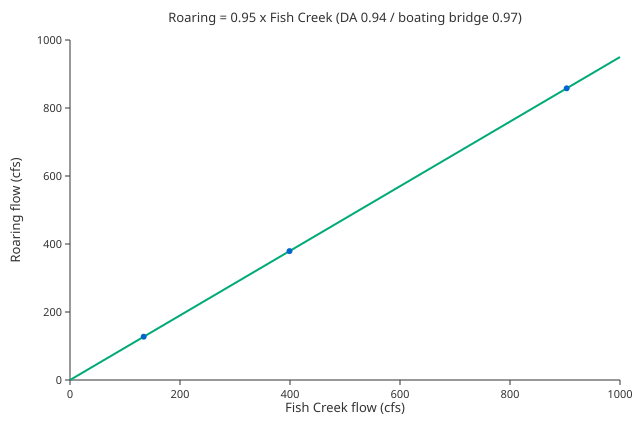

# Surrogate: Roaring River ← Fish Creek (drainage-area scaling)

**Status:** **deployed** — `calc_expression` id 25
(`provenance_slug = roaring_from_fishcreek`) on the virtual gauge `Roaring_FishCreek_calc`
(id 234) reads it, and reach 188 is re-pointed off the Oak Grove Fork stand-in to gauge
234. Companion to [`fishcreek_14209700_stage_rating.md`](fishcreek_14209700_stage_rating.md),
which supplies the Fish Creek flow this surrogate scales.

**Goal:** The Roaring River (reach `32` / id 188, class IV, Clackamas basin) has no
live gauge. It previously borrowed **gauge 159 = Oak Grove Fork at Ripplebrook (USGS
14209250)**, which is **dam-regulated** (PGE's Harriet Lake / Oak Grove project) and a
poor analog for the free-flowing Roaring. Boaters have long used **Fish Creek** as the
Roaring surrogate (adjacent, free-flowing, near-identical size). This formalizes that: a
virtual Roaring gauge = a scaled multiple of Fish Creek's (calc-derived) flow.



## The surrogate

> **Roaring ≈ 0.95 × Fish Creek**

Roaring (DA 42.4 mi², USGS 14209600) and Fish Creek (DA 45.1 mi², USGS 14209700) are
adjacent free-flowing Clackamas tributaries of nearly equal size. Three lines converge
for the **runnable regime**:

| method | Roaring / Fish Creek |
|---|---|
| Drainage-area ratio (42.4 / 45.1) | **0.94** |
| Clackamas-mainstem bridge, **boating season Oct–May** | **0.97** |
| Clackamas-mainstem bridge, all-year | 1.22 — skewed by summer baseflow, irrelevant to boating |

→ **0.95** for runnable flows. The historical Roaring gauge (`14209600`) ran **only
1966–68** and does **not overlap** Fish Creek's record (1989–2024), so no direct
Roaring↔Fish Creek regression is possible — this is a drainage-area surrogate
corroborated by the season bridge, **not** a fitted regression (the Roaring record is
too short for significance, per the same caution as any 3-year fit).

## Why not the mainstem mass-balance

The tempting check — `(Clackamas at Estacada 14210000) − (Clackamas above Three Lynx
14209500)` as the intervening tributary inflow — is **dam-contaminated**: the **North
Fork Clackamas dam / North Fork Reservoir sits between those two gauges**, so the
difference carries regulated NF Clackamas water, not clean tributary runoff (the
difference's median ~540 cfs vs Fish+Roaring ~240 reflects that). It was abandoned.

The clean alternative — used instead to validate **Fish Creek** (see the companion
report) — is the tight bracket straddling only the Fish Creek confluence
(`14209710` below − `14209670` above), all three sites upstream of the dam. That
validates the Fish Creek flow this surrogate builds on; the 0.95 Roaring factor rests
on DA + the boating-season bridge.

## Caveats

- **±, not exact.** A drainage-area surrogate with a season cross-check; treat as
  ~±15–20% — fine for a boating go/no-go, and it inherits Fish Creek's rating
  uncertainty and ~0.05 ft/yr aggradation drift (companion report). Both basins share
  rain/snow regime, so storm timing largely cancels in the ratio.
- The all-year ratio (1.22) shows Roaring runs proportionally higher at **summer
  baseflow** (steeper, higher basin) — so at very low flow 0.95 *under*-states Roaring;
  immaterial for boating, which happens at the higher flows where 0.94–0.97 holds.

## Deployment (when approved)

Two chained calc sources (the engine topo-sorts calc sources, so Fish Creek's flow
computes first):

1. **Fish Creek flow** on gauge 34 — see companion report.
2. **Roaring virtual gauge** — a new `Calculation` gauge + source:
   ```
   data_type:       flow
   expression:      round(0.95 * 14209700::flow, 0)
   time_expression: 14209700::flow
   note:            drainage-area surrogate, Roaring (USGS 14209600, DA 42.4) ~= 0.95 * Fish Creek (14209700, DA 45.1). DA ratio 0.94, Clackamas boating-season bridge 0.97; Roaring's 1966-68 record doesn't overlap Fish Creek so no direct regression. Reads Fish Creek's calc flow. See regression/roaring_from_fishcreek.md.
   provenance_slug: roaring_from_fishcreek
   ```
   Then **re-point reach 188** (`gauge_id` 159 → the new Roaring gauge), dropping the
   dam-regulated Oak Grove Fork.

Author via `sources.yaml` + `generate-sources` (sources/links) + a new `gauge.csv`
row + `calc_expression.csv` row + `id_counters` bumps + the `.svg`/`.json` sidecars.

## Future

- **If USGS resumes Fish Creek `00060`:** the Fish Creek flow calc is retired (companion
  report), `14209700::flow` becomes the *real* USGS flow, and this surrogate reads it
  automatically — Roaring improves with **no change here**.
- **If USGS re-activates the Roaring gauge itself (`14209600`):** drop the surrogate and
  re-point reach 188 to a direct USGS source — the ideal end state.
- **Oak Grove Fork (gauge 159):** decision pending — drop entirely on re-point, or keep
  as a labeled secondary reference. It stays valid for the regulated Oak Grove Fork's
  own runs regardless.

## Reproduce

```
# Roaring / Fish Creek drainage areas + Roaring's short record:
https://waterservices.usgs.gov/nwis/site/?format=rdb&sites=14209600,14209700&siteOutput=expanded
https://waterservices.usgs.gov/nwis/dv/?format=json&sites=14209600&parameterCd=00060&statCd=00003   # 1966-68
# Clackamas bridge (cross-era ratio): 14209600 vs 14210000 (Estacada), 14209700 vs 14210000
```
